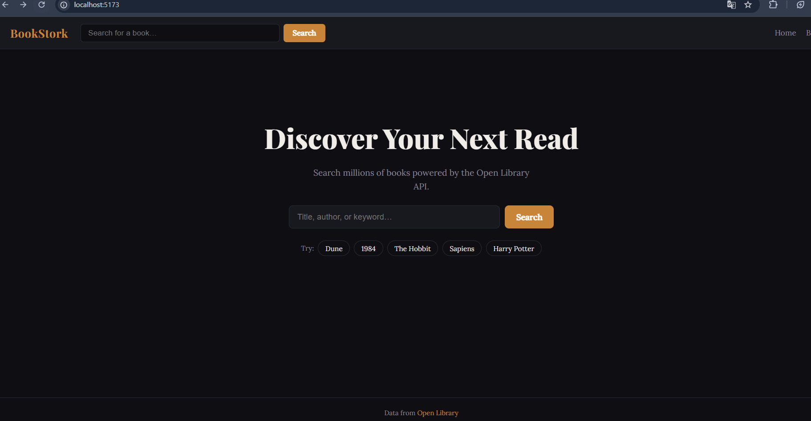
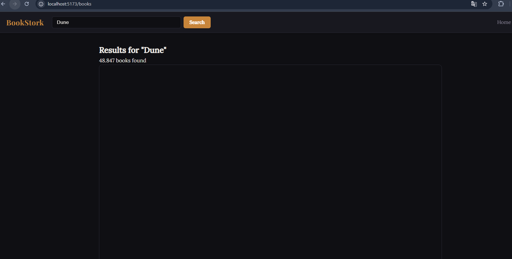
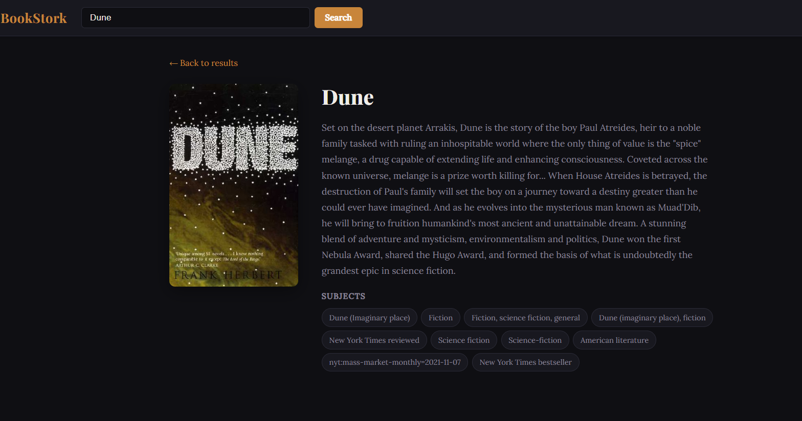

# BookStork

A Single-Page Application that searches and browses books using the [Open Library API](https://openlibrary.org/developers/api), built with **React 19 · TypeScript · Vite · React Router v7**.


## Overview

BookStork lets users search for any book by title, author, or keyword, browse results in a card grid, and open a detail view for each book. All navigation happens client-side with no full-page reloads.


## Screenshots

### Home Page



---

### Book Search Results


---

### Book Detail



## Project Structure

```
src/
├── router/
├── context/
├── hooks/
├── components/
└── pages/
```


## Running the Project

```bash
npm install
npm run dev
```

Open [http://localhost:5173](http://localhost:5173).

---

## Part 1 — React Router Analysis

### 1.1 Nested Routes

The router has a single **root route** at `"/"` that renders `<Layout>`. Layout holds a persistent `<Navbar>` and an `<Outlet />` where child routes render. Every page (`/`, `/books`, `/books/:workId`) is a child of that root.

```tsx
{
  path: "/",
  element: <Layout />,
  children: [
    { index: true,               element: <HomePage /> },
    { path: "books",             element: <BooksPage /> },
    { path: "books/:workId",     element: <DetailPage /> },
    { path: "*",                 element: <NotFound /> },
  ],
}
```

The Navbar is never unmounted during navigation, so its state (search input value) persists across route changes without any extra global state.

### 1.2 Dynamic Routes

`"books/:workId"` is a **dynamic segment**. React Router injects the runtime value into the component through `useParams`:

```tsx
const { workId } = useParams<{ workId: string }>();
```

One component handles every book's detail page — no route needs to be declared per book.

### 1.3 Route Matching

React Router matches routes from most-specific to least-specific within the children array:

| URL | Matched pattern | Rendered page |
|-----|----------------|---------------|
| `/` | `index: true` | `HomePage` |
| `/books` | `"books"` | `BooksPage` |
| `/books/OL82563W` | `"books/:workId"` | `DetailPage` |
| `/anything-else` | `"*"` | `NotFound` |

The catch-all `"*"` only fires when nothing else matches, guaranteeing the user always sees a meaningful page.


## Part 2  Advanced Hooks & State

### 2.1 `useContext` — architectural benefits

The search query is consumed by three independent parts of the component tree: `Navbar`, `HomePage`, and `BooksPage`. Without context, the query would have to be passed as a prop through every component in between — a pattern known as **prop drilling** that tightly couples unrelated components and makes refactoring painful.


```tsx
const { query, setQuery } = useSearch();
```

`SearchProvider` wraps the router in `App.tsx`, making the query available application-wide. The hook and the provider live in separate files (`useSearch.ts` / `SearchContext.tsx`) to satisfy the `react-refresh/only-export-components` ESLint rule required by Vite's Fast Refresh HMR.

### 2.2 Custom Hook `useFetch` API design

```ts
const { data, loading, error, refetch } = useFetch<T>(url, { enabled? });
```

| Return value | Type | Purpose |
|---|---|---|
| `data` | `T \| null` | Parsed JSON — generic, works with any endpoint |
| `loading` | `boolean` | `true` while the request is in flight |
| `error` | `string \| null` | Human-readable message on failure, otherwise `null` |
| `refetch` | `() => void` | Stable callback to re-run the request on demand |

**Implementation decisions:**

- **`useReducer` instead of `useState`** — all state transitions (`FETCH_RESET`, `FETCH_SUCCESS`, `FETCH_ERROR`) go through a single reducer. `dispatch` can be called inside `useEffect` without triggering cascading renders, which `setState` cannot.
- **`AbortController`** — every request is tied to a controller that is aborted when the URL changes or the component unmounts, preventing stale responses from overwriting fresh data.
- **`enabled` option** — allows deferring the fetch until a dependency is ready (e.g., waiting for a route param to be defined).
- **`refetch` trigger** — a counter in the dependency array of `useEffect` lets the caller force a re-fetch without changing the URL.

### 2.3 Lazy Loading — purpose

Each page component is imported with `React.lazy()` and wrapped in a `<Suspense>` boundary:

```tsx
const BooksPage = lazy(() => import("../pages/BooksPage"));

<Suspense fallback={<LoadingSpinner />}>
  <BooksPage />
</Suspense>
```

Vite treats each lazy import as a separate **code-split chunk**. The browser only downloads that chunk the first time the user navigates to the corresponding route. While the download completes, `<Suspense>` renders the `<LoadingSpinner />` fallback so the UI never appears broken.

---

## Dependencies

| Package | Version | Role |
|---|---|---|
| `react` | 19 | UI library |
| `react-dom` | 19 | DOM renderer |
| `react-router-dom` | 7 | Client-side routing |
| `typescript` | 5.9 | Static typing |
| `vite` | 8 | Dev server & bundler |

## I used Valis to ask and undersand routes, navigation and how to use the app. I also used it to ask about the features of the app and how to use them

