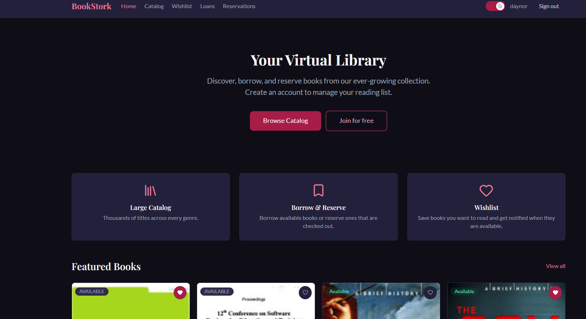
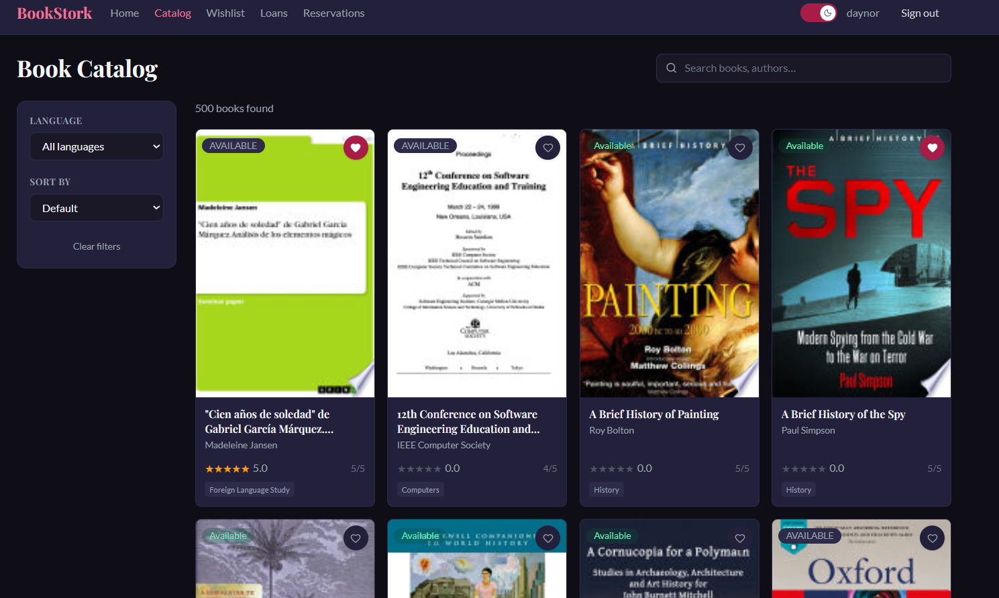
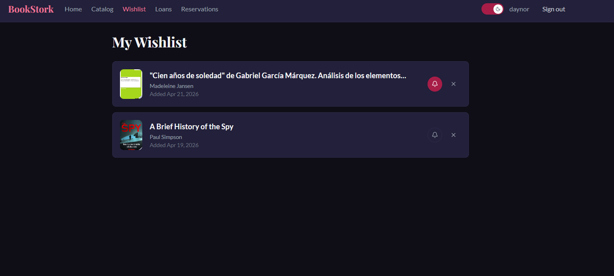
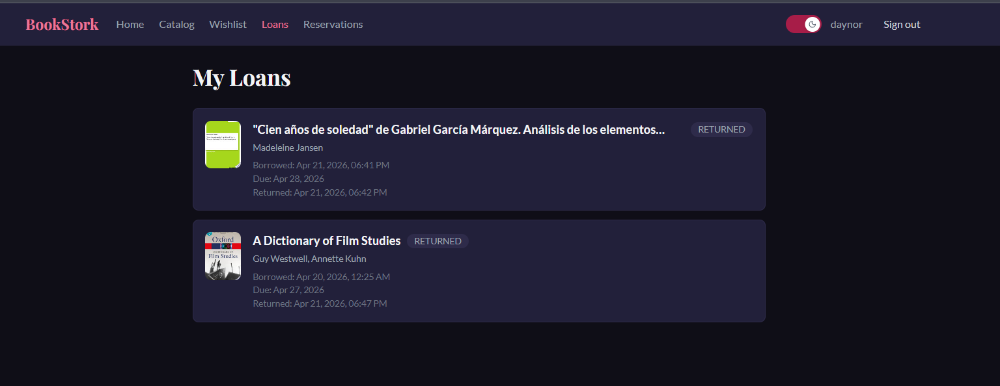
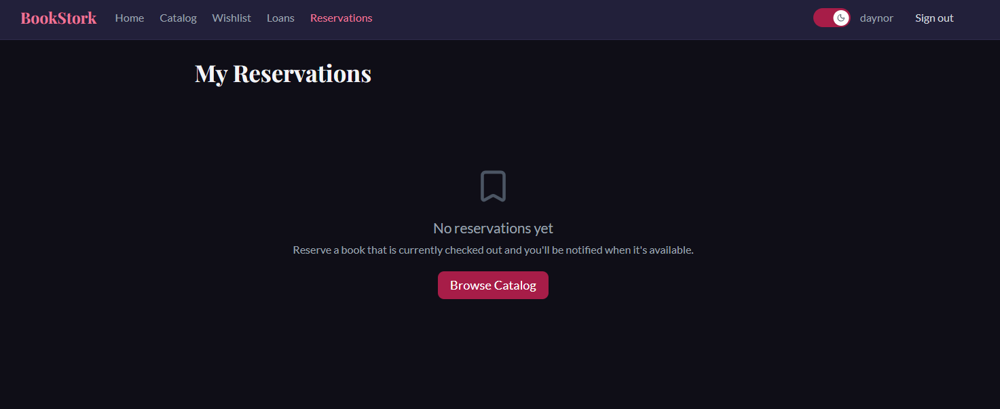
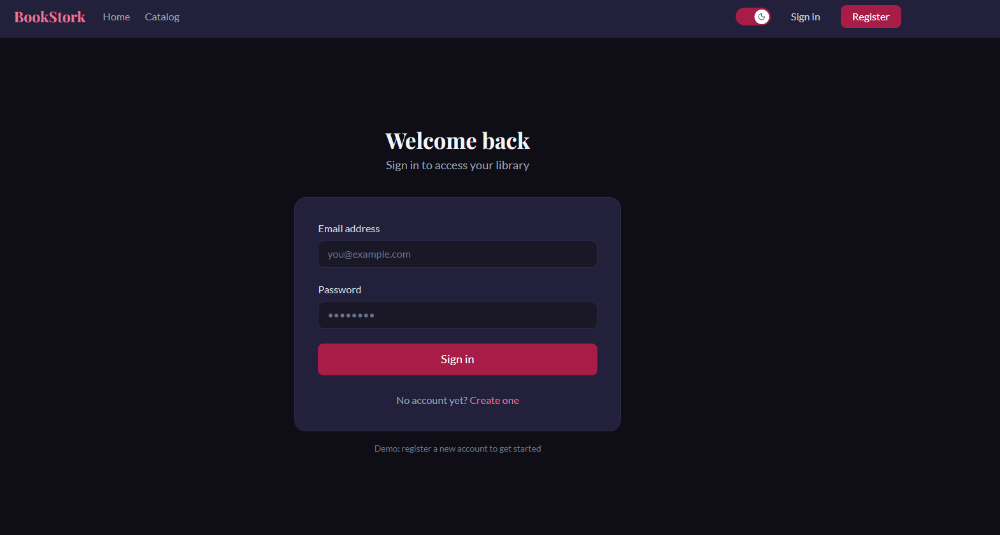
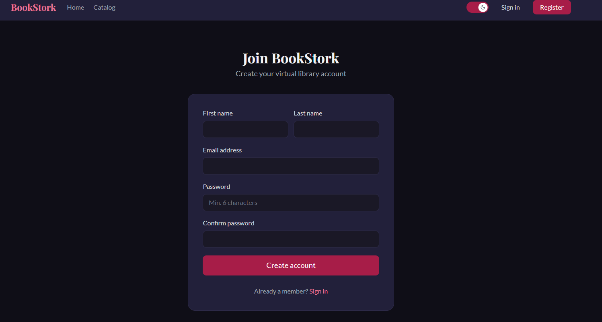

# BookStork

A full-stack library management system that lets registered users browse a book catalog, borrow books, reserve copies, and manage a personal wishlist — all in real time.

---

## Table of Contents

1. [Tech Stack](#tech-stack)
2. [Architecture](#architecture)
3. [Frontend Deep Dive](#frontend-deep-dive)
   - [Navigation](#navigation)
   - [Custom Hooks](#custom-hooks)
   - [State Management](#state-management)
   - [Performance Optimizations](#performance-optimizations)
   - [Ongoing Improvements](#ongoing-improvements)
4. [Unit Tests](#unit-tests)
5. [Installation](#installation)
   - [Prerequisites](#prerequisites)
   - [Option A — Docker Compose (recommended)](#option-a--docker-compose-recommended)
   - [Option B — Manual Setup](#option-b--manual-setup)

---

## Tech Stack

### Frontend

| Tool | Version | Role |
|---|---|---|
| React | 19 | UI library |
| TypeScript | 5.9 | Static typing |
| Vite | 8 | Dev server & bundler |
| React Router DOM | 6 | Client-side navigation |
| Redux Toolkit | 2.3 | Global state management |
| Tailwind CSS | 3.4 | Utility-first styling |
| Vitest | 4.1 | Unit test runner |
| Testing Library | latest | Component & hook testing |

### Backend

| Tool | Role |
|---|---|
| ASP.NET Core 8 | REST API |
| MediatR | CQRS command/query dispatcher |
| Entity Framework Core 8 | ORM & migrations |
| MySQL 8 | Relational database |
| SignalR | Real-time push notifications |
| JWT Bearer | Stateless authentication |
| Swashbuckle | Swagger/OpenAPI docs |

---

## Architecture

### Backend — Clean Architecture + CQRS

The backend is divided into four projects with a strict dependency rule (outer layers depend on inner layers, never the reverse):

```
BookStork.Domain          ← Core entities, value objects, domain events, repository interfaces
       ↑
BookStork.Application     ← Commands, Queries, DTOs, MediatR handlers, pipeline behaviors
       ↑
BookStork.Infrastructure  ← EF Core DbContext, repository implementations, JWT service,
                            SignalR hub, domain event dispatcher
       ↑
BookStork.Api             ← ASP.NET Core controllers, middleware, Swagger, DI wiring
```

Every write operation enters as a **Command** (e.g. `CreateLoanCommand`) and every read as a **Query** (e.g. `GetMyLoansQuery`). MediatR routes them to the corresponding handler in the Application layer. After an aggregate is mutated, domain events are dispatched and handled by SignalR to push real-time updates to connected clients on `/hubs/notifications`.

### Frontend — Feature-Sliced Architecture

The client is organized around vertical feature slices rather than technical layers:

```
src/
├── core/
│   ├── api/        apiClient.ts — fetch wrapper that injects JWT automatically
│   ├── config/     env.ts — BASE_URL (overridden at Docker build time)
│   ├── routes/     AppRoutes.tsx, ProtectedRoute.tsx
│   └── store/      Redux store — combines all feature reducers
├── features/
│   ├── auth/       login, register, authSlice, useAuth
│   ├── books/      catalog, detail, booksSlice, useBooks
│   ├── loans/      loans list, loansSlice, useLoans
│   ├── reservations/
│   └── wishlist/
└── shared/
    ├── components/ Layout, Navbar, Modal, Badge, StarRating, Pagination, ToastContainer
    ├── hooks/      useLocalStorage, useDebounce, useTheme, useToast
    ├── types/      All DTO interfaces and status union types
    └── utils/      constants.ts, formatDate.ts
```

Each feature is self-contained and follows the same four-layer pattern:

```
Service  →  Slice (createAsyncThunk)  →  Hook (selector + dispatch)  →  Page / Component
```

The `apiClient` (`core/api/apiClient.ts`) is a thin fetch wrapper that reads the JWT from `localStorage` and attaches an `Authorization: Bearer …` header to every request. On logout the token is cleared and the wishlist slice is reset.

---

## Frontend Deep Dive

### Navigation

Routing is handled by **React Router v6** with a single nested route tree. A persistent `<Layout>` wrapper renders the Navbar and an `<Outlet />` so the shell never unmounts during navigation.

```
/                   → HomePage
/catalog            → BooksPage
/catalog/:id        → BookDetailPage
/login              → LoginPage
/register           → RegisterPage
/wishlist  🔒       → WishlistPage
/loans     🔒       → LoansPage
/reservations 🔒    → ReservationsPage
*                   → redirect to /
```

**Lazy loading** — every page component is imported with `React.lazy()` and wrapped in a `<Suspense>` boundary. Vite treats each lazy import as a separate chunk, so the browser only downloads the code for a page the first time the user visits it. While the chunk is fetching, a `<PageLoader />` spinner is shown.

**Protected routes** — `<ProtectedRoute>` reads `isAuthenticated` from the Redux auth slice. Unauthenticated users are redirected to `/login` with the original location preserved in `state.from`, so they are sent back after a successful login.

### Custom Hooks

#### `useLocalStorage<T>(key, initialValue)`

A typed, SSR-safe wrapper around `localStorage`. It initialises state lazily by reading from storage on the first render and exposes a `setValue` that mirrors every React state update to `localStorage`. A third return value, `removeValue`, clears the key and resets state to `initialValue`. Supports both direct values and functional updaters (`prev => next`), the same API as `useState`.

#### `useDebounce<T>(value, delay = 300)`

Delays propagating a value until it has been stable for `delay` milliseconds. Every new value cancels the previous timer via the `useEffect` cleanup. Used on the book search input to avoid firing an API request on every keystroke — the network call only happens after the user pauses typing.

#### `useTheme()`

Reads the initial theme from `localStorage` (`bookstork_theme`) and falls back to `window.matchMedia('(prefers-color-scheme: dark)')`. A `useEffect` applies or removes the `dark` class on `document.documentElement` whenever the theme changes (Tailwind's dark mode class strategy). Returns `[theme, toggle]` so any component can flip the theme without knowing about storage.

#### `useToast()`

Manages an array of `Toast` objects in local component state. `addToast(message, type)` appends a new toast with a random ID and schedules its removal after 4 seconds via `setTimeout`. `removeToast(id)` allows immediate manual dismissal. The hook is consumed through a `ToastContext` so any component in the tree can fire a notification without prop drilling.

#### Feature hooks — `useAuth`, `useBooks`, `useBookDetail`, `useLoans`, `useReservations`, `useWishlist`

Each feature exposes a single hook that hides the Redux plumbing from pages. The hooks:
- Select only the slice state they need (avoids unnecessary re-renders).
- Wrap every dispatch call in `useCallback` so the function references are stable.
- Some hooks (`useLoans`, `useReservations`) auto-fetch their data on mount with `useEffect`, meaning the page component simply calls the hook and renders what comes back.
- `useWishlist` exposes an `isInWishlist(bookId)` helper that does a client-side array scan, avoiding an extra API round-trip when the book detail page needs to show whether a book is already in the user's wishlist.

### State Management

The Redux store combines five slices:

| Slice | Responsibilities |
|---|---|
| `auth` | JWT token, user object, `isAuthenticated`, login/register/logout thunks |
| `books` | Paginated book list, selected book detail, loading/error states |
| `loans` | User's active and past loans, borrow and return thunks |
| `reservations` | User's reservations, create and cancel thunks |
| `wishlist` | Wishlist items, add/remove/toggleNotify thunks |

**Why Redux Toolkit instead of local state or Context alone?**

Authentication state is consumed in many unrelated parts of the tree — the Navbar, every ProtectedRoute, the loan and reservation hooks that need the user ID. Passing this down through props would create deep coupling. Context re-renders every subscriber on every update, which is acceptable for slow-moving data (theme) but not for the loan list that mutates on every borrow or return. Redux Toolkit gives predictable updates, time-travel debugging, and selectors that re-render only the components that actually need a given slice of state.

Each slice uses `createAsyncThunk` for async operations. Thunks catch API errors and use `rejectWithValue` to pass a human-readable string into the `rejected` case, so the UI can display the message without inspecting raw error objects. After a successful write (borrow, reserve, add to wishlist), the fulfilled handler mutates the local slice state optimistically — the list is updated immediately without waiting for a full re-fetch.

### Performance Optimizations

| Technique | Where | Effect |
|---|---|---|
| `React.lazy` + `Suspense` | All 8 page components | Each page is a separate bundle chunk; the initial load only downloads the home page |
| `useDebounce` on search input | `BooksPage` | Reduces API calls from one-per-keystroke to one-per-pause |
| `useCallback` on all dispatch wrappers | Every feature hook | Stable function references prevent unnecessary child re-renders |
| Optimistic slice updates | `loansSlice`, `reservationsSlice`, `wishlistSlice` | UI responds instantly; no full re-fetch needed after a write |
| Lazy `localStorage` init | `useLocalStorage`, `authSlice` | State is read from storage only on the first render, not on every update |
| `v8` coverage + selective exclusions | `vite.config.ts` | Test runs exclude routes, data seeds, and type files that have no branch logic |

### Ongoing Improvements

- **Real-time notifications via SignalR** — the backend already publishes domain events to `/hubs/notifications` after every loan, reservation, and wishlist change. The frontend client is being connected to this hub so users receive live updates without polling.
- **Pagination on all list views** — the API returns a `PagedResult<T>` envelope (`page`, `totalPages`, `hasNextPage`…). The `<Pagination>` component is already implemented; it is being wired up to the loans and reservations pages.
- **Per-field validation feedback** — login and register forms currently surface server errors as a single banner. Field-level inline errors are being added.
- **Skeleton loading screens** — `<LoadingSpinner>` covers the whole page during chunk loads. Per-card skeletons in the catalog grid are planned to improve perceived performance.

---

## Unit Tests

Tests are written with **Vitest** (Jest-compatible API) and **Testing Library**, running in a **jsdom** environment. The setup file (`setup.ts`) mocks `localStorage` with an in-memory store and calls `cleanup()` + `localStorage.clear()` + `vi.clearAllMocks()` after every test, so each case starts with a blank slate.

There are nine test files covering the shared hooks and UI components — the parts of the codebase that have the most reuse and the most edge cases:

### Shared Hook Tests

#### `useLocalStorage.test.ts` — 7 cases

Validates the full contract: reading a missing key returns the initial value; an existing JSON value is parsed; `setValue` persists to storage and updates React state; the functional updater form (`prev => next`) works; `removeValue` deletes the key and resets state; objects are serialized correctly; invalid JSON in storage falls back gracefully.

The hook is tested in isolation with `renderHook` — no component mounting needed — which keeps the tests fast and focused on the hook logic itself.

#### `useDebounce.test.ts` — 6 cases

Time-dependent behaviour is verified using `vi.useFakeTimers()`, which gives the tests full control over the clock without real waiting. Cases confirm that the initial value is returned immediately, the value does not change before the delay, it does change exactly at the deadline, rapid successive updates reset the timer each time (only the last value is emitted), the default 300 ms delay is respected, and the hook works with numeric types.

Fake timers are essential here: without them the tests would either have to `await` real milliseconds (slow, flaky) or not be able to test timing at all.

#### `useTheme.test.ts` — 8 cases

`window.matchMedia` is not implemented in jsdom, so each test that needs it installs a minimal stub via `vi.fn()`. Cases cover: light default when the system preference is light; dark default when the system preference is dark; stored preference overrides the system; toggle switches both ways; the `dark` CSS class is added to / removed from `document.documentElement`; and the toggled value is persisted to `localStorage`.

Testing the DOM side effect (class manipulation) is important because `useTheme`'s value is only useful if it actually drives Tailwind's dark mode.

#### `useToast.test.ts` — 8 cases

Uses fake timers again to verify auto-dismissal. Cases confirm: empty initial state; correct message and type on `addToast`; default type `"info"`; toast disappears after exactly 4 000 ms; toast is still present at 3 999 ms; `removeToast` removes by ID; only the targeted toast is removed when multiple exist; every toast gets a unique ID.

The unique-ID test matters because duplicate IDs would cause React key conflicts and the wrong toast being dismissed.

### UI Component Tests

#### `Badge.test.tsx` — 9 cases + parameterized `getStatusVariant`

Checks that the component renders as a `<span>`, forwards `className`, and applies the correct Tailwind color classes for each variant (`success`, `warning`, `error`, `info`, `default`). The `getStatusVariant` helper is tested as a parameterized table with `it.each` covering all known status strings plus `null` and `undefined` — catching any future status that is added to the API without a corresponding mapping.

#### `StarRating.test.tsx` — 9 cases

Covers rendering (5 stars by default, custom `maxStars`), conditional value display, disabled state when `interactive={false}`, enabled state when interactive, `onRate` called with the correct numeric value on click (third star → `3`), `onRate` not called when not interactive, and correct `aria-label` attributes (`"1 star"`, `"2 stars"`, etc.) for screen-reader accessibility.

#### `Modal.test.tsx` — 10 cases

The Modal is rendered into a portal and must be tested through its ARIA role (`dialog`). Cases verify: nothing rendered when `isOpen={false}`; dialog visible when open; children rendered; optional title rendered; `onClose` called via the close button, the backdrop overlay, and the `Escape` key; `Enter` does not call `onClose`; `aria-modal="true"` and `aria-labelledby` are set when a title is present; `aria-labelledby` is absent when there is no title.

Keyboard and backdrop tests reflect real user behaviour — if either path is broken, users cannot dismiss the modal without reloading the page.

#### `Pagination.test.tsx` — 10 cases

Confirms: nothing rendered at a single page; navigation rendered for multiple pages; Prev disabled on page 1; Next disabled on the last page; both enabled on a middle page; `onPageChange` called with `page - 1` and `page + 1` respectively; clicking a numbered button calls `onPageChange` with the correct page; the active page has `aria-current="page"`; an ellipsis is rendered when the page range is non-contiguous.

#### `ToastContainer.test.tsx` — 7 cases + parameterized icon colors

Verifies that the wrapper is empty with no toasts, that messages are rendered, that multiple toasts coexist, that clicking "Dismiss" calls `onRemove` with the right ID, that only one dismiss button targets each toast, and that the correct icon color class (`text-emerald-400`, `text-red-400`, `text-blue-400`, `text-amber-400`) is applied per toast type — tested with `it.each`.

---

## Installation

### Prerequisites

| Tool | Minimum version |
|---|---|
| Node.js | 20 LTS |
| npm | 10 |
| .NET SDK | 8.0 |
| MySQL | 8.0 |
| Docker + Docker Compose | 24 / v2 (optional) |

---

### Option A — Docker Compose (recommended)

This option spins up MySQL, the .NET API, and the React frontend in three containers with a single command.

**1. Clone the repository**

```bash
git clone <repo-url>
cd capstone
```

**2. Start all services**

```bash
docker compose up --build
```

Docker Compose will:
- Start a MySQL 8 container and wait for it to be healthy before starting the API.
- Build the .NET API from `book-stork-service/Dockerfile` and start it on port **5000**.
- Build the React SPA from `book-stork-client/Dockerfile` (passing `http://localhost:5000` as the API URL at build time) and serve it with nginx on port **5173**.

**3. Apply database migrations**

Once the API container is running, the EF Core migrations need to be applied once:

```bash
docker compose exec api dotnet ef database update \
  --project src/BookStork.Infrastructure \
  --startup-project src/BookStork.Api
```

**4. Open the application**

| Service | URL |
|---|---|
| Frontend | http://localhost:5173 |
| API (Swagger) | http://localhost:5000/swagger |
| MySQL | localhost:3306 |

**5. Stop the services**

```bash
docker compose down          # stop and remove containers
docker compose down -v       # also remove the database volume
```

> **Note on CORS** — the backend's `AllowFrontend` CORS policy is pre-configured for `http://localhost:5173`. The Docker Compose file binds the frontend to port 5173 specifically so that this policy applies without any code changes.

---

### Option B — Manual Setup

#### 1. Database

Create a MySQL 8 database:

```sql
CREATE DATABASE bookstork_dev CHARACTER SET utf8mb4 COLLATE utf8mb4_unicode_ci;
```

The default connection string expects:
- Host: `localhost:3306`
- Database: `bookstork_dev`
- User: `root`
- Password: `123456`

Update `book-stork-service/src/BookStork.Api/appsettings.Development.json` if your credentials differ.

#### 2. Backend

```bash
cd book-stork-service

# Restore packages
dotnet restore

# Apply EF Core migrations
dotnet ef database update \
  --project src/BookStork.Infrastructure \
  --startup-project src/BookStork.Api

# Run the API (listens on http://localhost:5000 by default)
dotnet run --project src/BookStork.Api
```

Swagger UI is available at `http://localhost:5000/swagger` when running in the Development environment.

#### 3. Frontend

```bash
cd book-stork-client

# Install dependencies
npm install

# Point the client at your local API
# Edit src/core/config/env.ts and set:
#   export const BASE_URL = 'http://localhost:5000';

# Start the dev server
npm run dev
```

The app will be available at `http://localhost:5173`.

#### 4. Frontend scripts reference

```bash
npm run dev        # Vite dev server with HMR
npm run build      # Type-check + production bundle  → dist/
npm run preview    # Serve the production bundle locally
npm run test       # Run all Vitest tests
npm run coverage   # Vitest tests with v8 coverage report
npm run lint       # ESLint
npx vitest run src/path/to/file.test.ts   # Run a single test file
```

---

#### 5. ETL — import books from Google Books (optional)

The `etl-migration/` directory contains a one-shot Node.js script that seeds the database from the Google Books API.

```bash
cd etl-migration
npm install
npm start
```

Make sure the API is running and the database is accessible before running the ETL.


### Home page


### Catalog page




### Book detail page


### Wishlist page



### Loans page



### Reservations page



### Login page



### Register page


